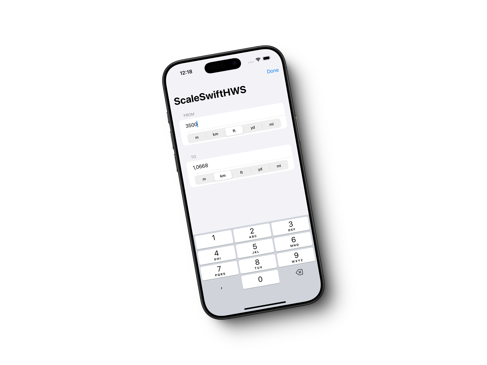

# ScaleSwiftHWS

La aplicación que contiene el repositorio es la solución propuesta al desafío de [Paul Hudson](https://x.com/twostraws) en su curso [Hacking with Swift - 100 Days of SwiftUI](https://www.hackingwithswift.com/100/swiftui). Corresponde al día 19: [Day 19 – Challenge day](https://www.hackingwithswift.com/100/swiftui/19) y permite convertir distancia entre metros, kilómetros, pies, yardas y millas.

